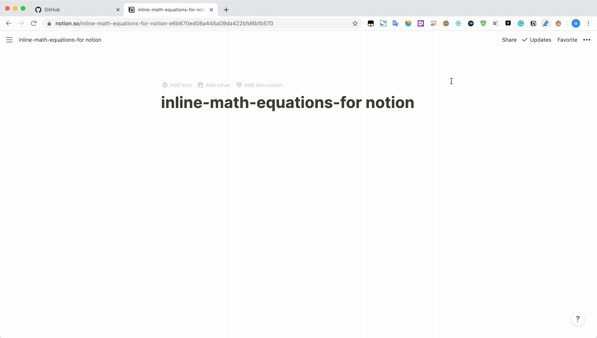
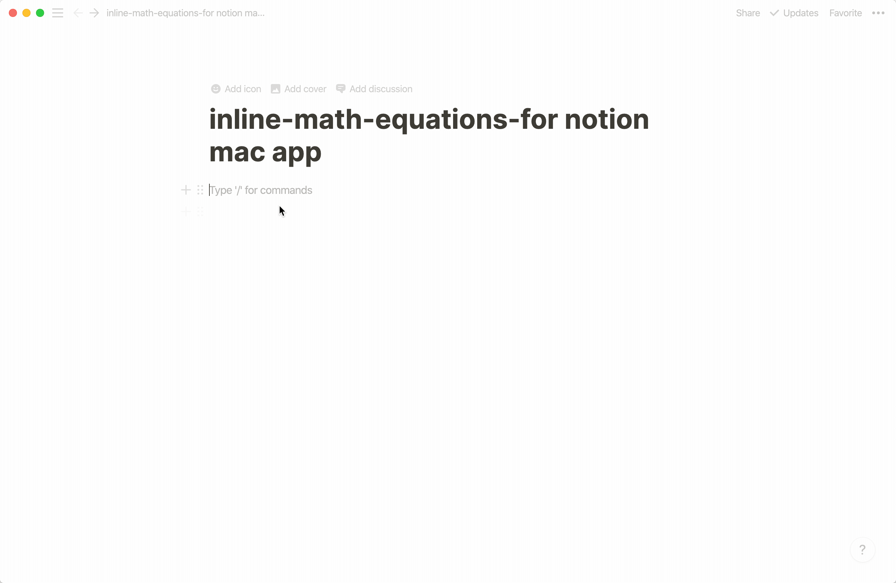
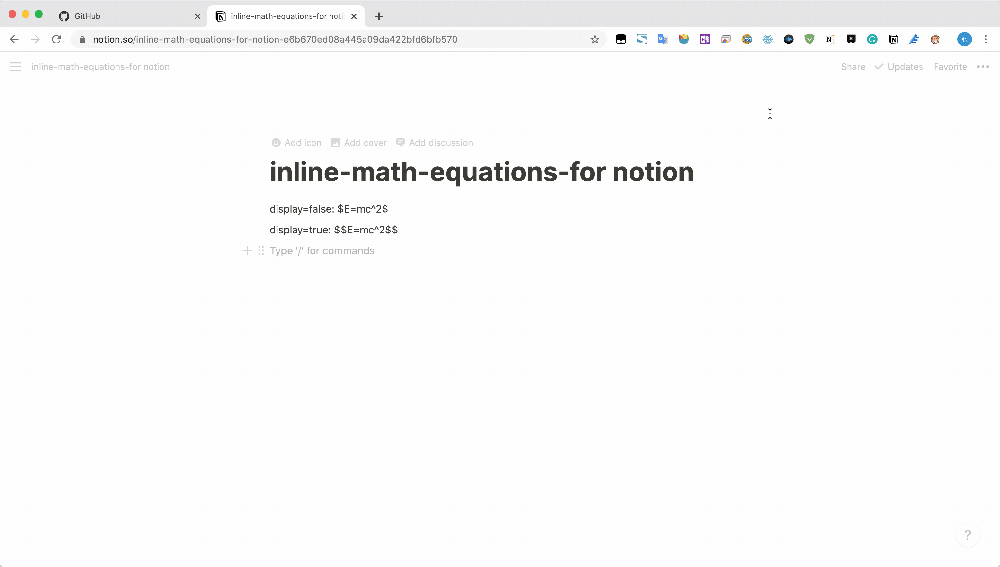

# inline-math-equation-for-notion

This repository include three **js** scripts.

- notion-inline-math-equations-web.js
- notiton-inline-math-equations-mac.js
- notion-inline-render-by-inlineCode.js

## acknowledgement

These scripts are based on:

1. https://github.com/evertheylen/notion-inline-math
2. https://github.com/Penguinlay/notion-inline-latex
3. https://github.com/ghosw/notion-inline-math-equations
4. https://gist.github.com/denosawr/8a5e434bd97154fba81ea91e79a8c99b

## Inline math equations for Notion.so

`notion-inline-math-equations-web.js` is valid for Notion.so.

1. Firstly, install [violentmonkey](https://chrome.google.com/webstore/detail/violentmonkey/jinjaccalgkegednnccohejagnlnfdag?utm_source=chrome-ntp-icon).
2. Open dashboard.
3. Left above button - install from url;
4. insert url: https://raw.githubusercontent.com/MLZC/inline-math-equation-for-notion/master/notion-inline-math-equations-web.js
5. Confirm installation.

### Feature

- Does not need any norm math block.
- Use "$$" instead of "\`$$\`", doesn't need `command + e` to enter inline code model before.

### Example



## Inline math equations for Notion Mac App

Prepare in advance:

1. install homebrew
    >/bin/bash -c "$(curl -fsSL https://raw.githubusercontent.com/Homebrew/install/master/install.sh)"
2. install `npm`
    >brew install npm
3. install `asar`
    >npm install -g asar 
4. Download `notiton-inline-math-equations-mac.js`.
5. Notion App for mac.
6. extract app from app.asar
    ```
    cd /Applications/Notion.app/Contents/Resources;
    asar extract app.asar app;
    ```

And do the following step:

1. Open /Applications folder by using Finder;
2. Find Notion and Right-clicking.
3. Shown Package Contents;
4. Continue  into:
      >/Applications/Notion.app/Contents/Resources/app/renderer/preload.js
5. Insert all contents from `notiton-inline-math-equations-mac.js` at the end of `preload.js`.

Or using the one-click script.

1. Download `notiton-inline-math-equations-mac.js` and `patcher.sh`.
2. Assure this two file are in the same location.
3. Grant Permissions:
    >chmod 777 ./patcher.sh
4. Patch
    >./patcher.sh


Features same as previous one.

### Example




## notion-inline-render-by-inlineCode.js

`notion-inline-render-by-inlineCode.js` is also valid for Notion.so.

1. Firstly, install [violentmonkey](https://chrome.google.com/webstore/detail/violentmonkey/jinjaccalgkegednnccohejagnlnfdag?utm_source=chrome-ntp-icon).
2. Open dashboard.
3. Left above button - install from url;
4. insert url: hhttps://github.com/MLZC/inline-math-equation-for-notion/blob/master/notion-inline-math-render-by-inlineCode.js
5. Confirm installation.

### Feature:

  - Make sure you have at least one normal math block on your page
  - Use inline code starting with "\$" and end with "\$". For example: `$E=mc^2$`, or \$E=mc^2\$ select the string before and press `command + E`.
  - Press `Alt` to rerender all inline math. You can of course change the shortcut in the code below.
  - The inline math will revert to inline code when the block becomes active.

### Example



